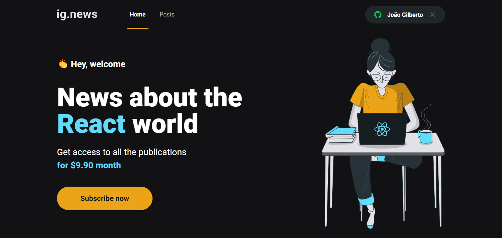
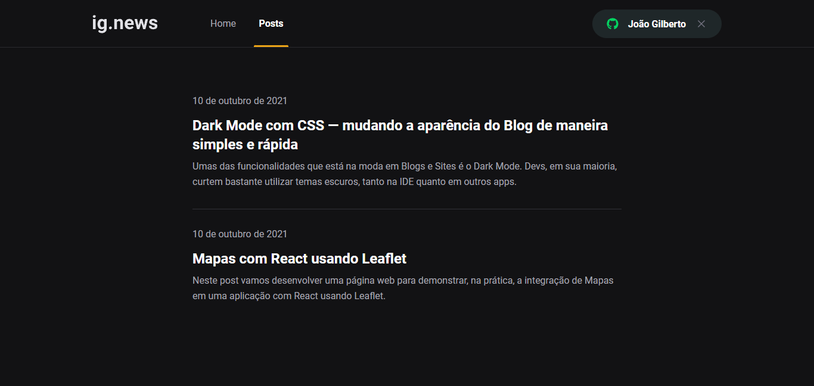

<div align="center">
  
</div>

<h3 align="center">
  News about the <b>React</b> world.
</h3>

<h4 align="center">
  Projeto construído durante a Trilha React do Ignite
</h4>

---




## Tecnologias

- [ReactJS](https://reactjs.org/)
- [TypeScript](https://www.typescriptlang.org/)
- [Next.js](https://nextjs.org/)
- [Fauna](https://fauna.com/)
- [Stripe](https://stripe.com/br)
- [Sass](https://sass-lang.com/)
- [Node.JS](https://nodejs.org/en/)

## Instalação

> Adicione as variáveis de ambiente em um arquivo `.env.local`. Veja o `.env.local.example`.

```bash
  # Clone o repositório
  $ https://github.com/gjoao11/ignews.git

  # Acesse o diretório do app
  $ cd ignews

  # Instale as dependências
  $ yarn

  #Inicie a aplicação
  $ yarn dev

  # acesse `http://localhost:3000`
```

## Licença

Este projeto está sob a licença MIT. Veja a arquivo [LICENSE](https://github.com/gjoao11/ignews/blob/main/LICENSE) para mais detalhes.
